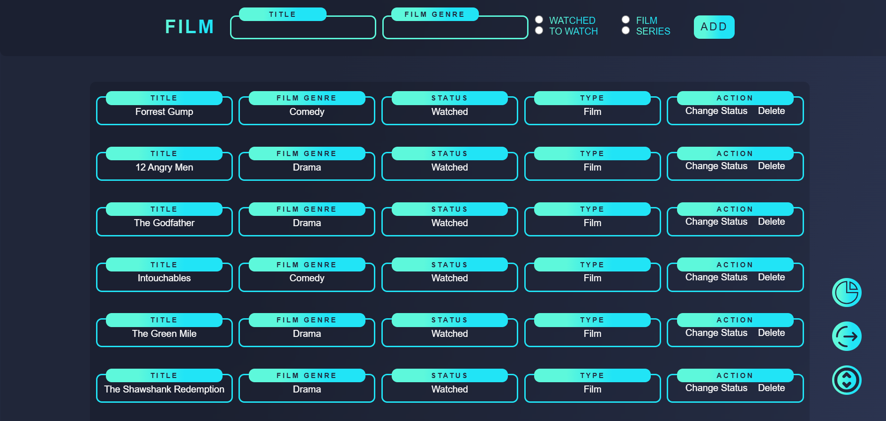
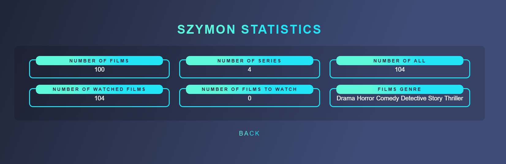

# FilmLog 

FilmLog to aplikacja webowa stworzona w języku Python z wykorzystaniem frameworka Flask. Umożliwia ona zarządzanie listą filmów obejrzanych oraz zaplanowanych do obejrzenia.

---

## 📌 Funkcjonalności

✅ Rejestracja i logowanie użytkowników.  
✅ Dodawanie filmów do listy obejrzanych oraz zaplanowanych do obejrzenia.  
✅ Każdy film posiada następujące atrybuty:  
   - 🎬 **Tytuł**  
   - 🎭 **Gatunek**  
   - 🎞️ **Typ** (film lub serial)  
   - ✅ **Status** (obejrzany lub zaplanowany do obejrzenia)  
✅ Możliwość edycji statusu filmu (zmiana między obejrzanym a zaplanowanym).  
✅ Możliwość usunięcia filmu z listy.  
✅ Statystyki użytkownika:  
   - 📊 Liczba obejrzanych filmów  
   - 📊 Liczba zaplanowanych filmów  
   - 📊 Liczba filmów i seriali  
   - 📊 Łączna liczba wszystkich dodanych tytułów  
   - 📊 Podział filmów według gatunków  

---

## 🖼 Zrzuty ekranu

## 🛠 Wymagania

- Python 3.8+
- Flask
- SQLite (lub inna baza danych obsługiwana przez Flask)

---

## 📢 Nowa wersja w trakcie tworzenia!

Obecnie pracuje nad nową, ulepszoną wersją aplikacji FilmLog! 🎉  
Nowa wersja będzie zawierać:  

✅ **Frontend w React** – lepsza responsywność i płynniejsza nawigacja  
✅ **Backend w Flask** – szybka i stabilna obsługa danych  
✅ **Rozszerzone funkcjonalności**, w tym:  
   - 🔎 Możliwość wyszukiwania i filtrowania filmów  
   - 📂 Grupowanie filmów według różnych kategorii  
   - 📝 Dodawanie szczegółowych informacji o filmie (np. opis)  
   - 🔍 System weryfikacji filmów dodawanych przez użytkowników  

## 🚀 Nowa wersja FilmLog
Sprawdź postępy tutaj: **[FilmLog 2.0](https://github.com/timon0420/Films-with-react)**